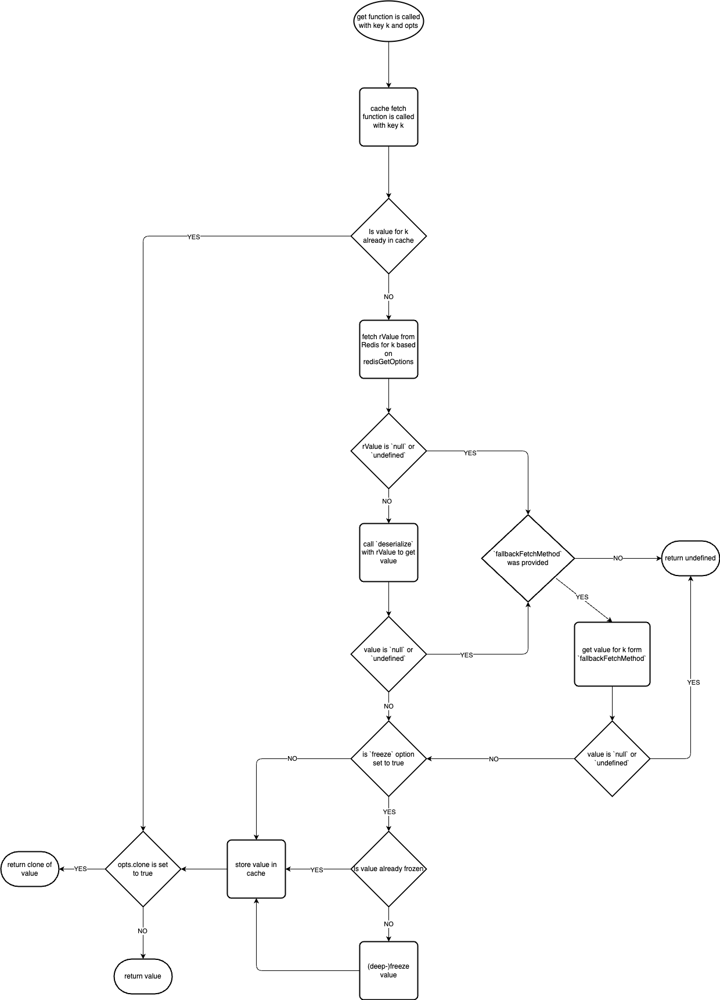

# Redis Value Cache

An in memory cache backed by redis with fallback fetch option. You can cache values from complex objects to strings or numbers.

This module expects a Redis server where values are stored and messages about changes for these values are published.

This module only makes read operations on the redis server so you need to save your values and publish updates with other modules.

## Use Case

This module is designed for applications that require caching of frequently accessed data from a Redis server, with the ability to handle real-time updates.

Key Features:

* Reduced Latency: Frequently accessed data is stored in a local cache, minimizing the need for repeated Redis queries and reducing access times.
* Real-Time Updates: The module subscribes to Redis channels to receive and apply updates to the cache as soon as they happen.
* Reduced Server Load: By offloading frequent data access to the local cache, the load on your Redis server is reduced.

## Basics

* The module provides a class RedisValueCache.
* The class uses an LRU cache to store values.
* Keys must be the same keys you use in redis.
* Values can be anything you want except `null` and `undefined`.
* The constructor requires you to provide functions to deserialize information from redis:
	* `genKeyFromMessage`: A function that takes a message from redis and returns the key that needs to be updated.
	* `deserialize`: A function that takes a value from redis and returns the value to be cached.
* Please be sure to handle errors that can occur in these functions appropriately (e.g).
* If these functions return `null` or `undefined`, the message/value will be ignored.
* Updates are received over Redis and values can be taken from redis or external sources.

## Options

* `redis`: Options connected to Redis
	* `redis.clientOpts` (Optional): Options for the node-redis client ([details](https://github.com/redis/node-redis/blob/master/docs/client-configuration.md)). Used for both `subscriber` and `client`.
	* `redis.client` (Optional): Redis client to duplicate for both subscriber and client. Will be prioritized over `redis.clientOpts` if both are provided.
	* `redis.channelOpts`: Options whether the `subscriber` should pSubscribe or subscribe normally.
	* `redis.getOpts`: Options on how the data should be retrieved from redis. Supported options `GET`, `HGET` and `HGETALL`.
* `genKeyFromMsg`: Function that takes a message and returns a key that needs to get updated. The return must be a string.
* `deserialize`: Function that takes data retrieved from Redis and the key and returns a value that should be saved in the cache.
* `cacheMaxSize` (Optional): Max number of objects to be stored in the LRU cache (Default = 1000).
* `errorHandlerStrategy` (Optional): Options for how errors that happen when fetching data from redis should be handled.**Other errors will still be thrown disregarding this option**.
	* `"emit"`: Emits the error as an `"unexpectedError"` event.
	* `"warn"`: (Default): Uses `console.warn()` to print the error.
	* `"throw"`: Throws the error.
	* `"ignore"`: Ignores the error.
* `fallbackFetchMethod` (Optional): Function that should be used to fetch data if the data aws not found in redis.
* `onMessageStrategy` (Optional): Options for how the RedisValueCache should behave once it receives a message.
	* `"drop"` (Default): The value will be deleted from the cache.
	* `"refetch"`: If a value was already the cache the updated value will be fetched.
	* `"fetchAlways"`: The updated value will always be fetched even if it was not in the cache before.
* `freeze` (Optional): Whether or not to freeze values when they are cached (Default = true).

## Usage (TypeScript)

### Basic Example

```ts
import { RedisValueCache } from "redis-value-cache";

const rvc = new RedisValueCache<string>({
	redis: {
		channelOpts: {
			type: "subscribe",
			name: "channelName"
		},
	
		getOpts: {
			type: "GET"
		}
	},

	genKeyFromMsg: (msg: string) => {
		return msg;
	},
	
	deserialize: (redisValue: string, key: string) => {
		return redisValue;
	},

	onMessageStrategy: "refetch",

	errorHandlerStrategy: "ignore"
})

await rvc.connect();

const x = await rvc.get("abc");

await rvc.quit();
```

### Basic Example With .new() Function

```ts
import { RedisValueCache } from "redis-value-cache";

const rvc = RedisValueCache.new<string>({
	redis: {
		channelOpts: {
			type: "subscribe",
			name: "channelName"
		},
	
		getOpts: {
			type: "GET"
		}
	},

	genKeyFromMsg: (msg: string) => {
		return msg;
	},
	
	deserialize: (redisValue: string, key: string) => {
		return redisValue;
	},

	onMessageStrategy: "refetch",

	errorHandlerStrategy: "ignore"
})

// no need to connect anymore since .new() function returns already connected RedisValueCache

const x = await rvc.get("abc");

await rvc.quit();
```

### More Complex Example

```ts 
import { RedisValueCache } from "redis-value-cache";
import { createClient } from "redis";

interface msgType {
	id: number;
	info?: string;
}

// type of the objects you want to store
interface storedObjectType {
	type: "a" | "b";
	data: Record<string, unknown>;
}

const redisClient = createClient({
	socket: {
		host: "localhost",
		port: 6379
	}
});

const opts: Opts<storedObjectType> = {
	redis: {
		client: redisClient,
		// options to subscribe / psubscribe
		channelOpts: {
			type: "pSubscribe"
			name: "channel*",
		},
		// options to define how the client gets the data from redis
		getOpts: {
			type: "HGET",
			argument: "info"
		}
	},

	// maximum allowed number of objects to be stored in lru-cache
	cacheMaxSize: 5000,
	// function to extract key from message
	genKeyFromMsg: (msg: string) => {
		try{
			const msgObject = JSON.parse(msg) as msgType;

			// keys must be string and should be same as you use in redis
			return `key:${msg.id}`;
		} catch (error) {
			// custom error logic here
			
			// to tell cache to ignore message
			return null;
		}
	},
	// function to adjust redisValue to the way you want to store it
	// type of redisValue should change depending on the redisGetOpts
	deserialize: (redisValue: string, key: string) => {
		try{
			const value = JSON.parse(redisValue) as storedObjectType;
			return value;
		} catch (error) {
			// custom error logic here
			
			// to tell cache to ignore message
			return null;
		} 
	},
	// how to deal with unexpected errors during fetch of data
	errorHandlerStrategy: "emit",
	// function to get the value from a third source if the `deserialize` function returns null
	fallbackFetchMethod: async(key: string) => {
		const resp = await fetch(`url/get/${key}`);
		const value = await resp.json() 
		return value as storedObjectType;
	}
}

// rvc emits all redis client error events as error events
rvc.on("error", (error, client: "subscriber" | "client") => {
	console.log(error):
	// your logic on how to handle error
});

// is emitted when the rvc is ready to use
rvc.on("ready", () => {
	console.log("rvc ready");
	// your logic here
	// will be emitted once during connect
	// can be useful for reconnection logic
});

// will emit errors in fetch functions if errorHandle option was set to emit
rvc.on("unexpectedError", (error) => {
	console.log(error);
	// your logic here
})

await rvc.connect();

const x = await rvc.get("key:1234",  { clone: true });

await rvc.quit();
```

## Emitted Events

| Name                    | When                                                                               | Listener arguments                                         |
|-------------------------|------------------------------------------------------------------------------------|------------------------------------------------------------|
| `ready`                 | RedisValueCache is ready to use                                                    | *No arguments*                                             |
| `error`                 | Either the `client` or the `subscriber` emitted an error event or failed to quit   | `(error: Error, client: "subscriber" \| "client")`         |
| `unexpectedError`       | Something was thrown during a fetch attempt                                        | `(error: unknown, ctx: {key: string} \| {msg: string} )`   |
| `dropped`               | A value was dropped because of a message   (`onMessageStrategy` = `"drop"`)        | `(key: string)`                                            |
| `refetched`             | A value was refetched because of a message (`onMessageStrategy` = `"refetch"`)     | `(key: string)`                                            |
| `fetched`               | A value was fetched because of a message   (`onMessageStrategy` = `"fetchAlways"`) | `(key: string)`                                            |


**!!Warning!!:** You **MUST** listen to `error` events. If a RedisValueCache doesn't have at least one `error` listener registered and an `error` event occurs, that error will be thrown and the Node.js process will exit. See the [`EventEmitter` docs](https://nodejs.org/api/events.html#events_error_events) for more details.

If an error event is emitted the RedisValueCache **flushes the cache** because it could miss messages.

## Functions

### .new(opts)

Static function that returns a promise for a new RedisValueCache. The RedisValueCache is ready to use since the `.connect()` function will be already called for you.

Params: 

`opts` (Opts): Options for creating a RedisValueCache.

Be aware that this function will throw an error if you have connection issues since no error listener was registered at the time the Clients try to connect to the Redis server.

### .get("key", opts)

Function to retrieve a value either from cache or Redis. Returns `undefined` if key could not be found.

Params: 

* `key` (string): Key of the value you want to look up.
* `opts` (object | Optional): Options for the get function.
	* `opts.clone` (boolean | Optional): Whether or not the value should be cloned before returning it.

#### Why Use The Clone Option?

If you do not use the clone option, the cache will return a reference to the stored object. This **object is read only** if you did not set the `freeze` option to false.

#### Flowchart



### .connect()

Function to call the `.connect()` function for both `subscriber` and `client` and also subscribes/pSubscribes the `subscriber` to the channel(s).

This function needs to be called in order to be able to use the RedisValueCache if it was not created using the `.new()` function.

### .disconnect()

Function to call the `.disconnect()` function for both `subscriber` and `client`. This forcibly closes a client's connection to Redis immediately. This also flushes the cache.

### .quit()

Function to call the `.quit()` function for both  `subscriber` and `client`. This gracefully closes a client's connection to Redis. This also flushes the cache.

### .delete()

Function to delete a value from the cache. Returns `true` if value was in cache.

Params:

* `key` (string): Key of the value you want to delete.

This function should not be used to often but can be used to force a refresh for the value.

### getConnected()

Function returns true if both clients are connected, otherwise returns false.

## Disconnects

If a disconnect, whether wanted or unwanted, occurs, the cache is flushed since potential change messages could be missed.

Both clients will try to reconnect to the server depending on the [reconnect Strategy](https://github.com/redis/node-redis/blob/master/docs/client-configuration.md#reconnect-strategy) of the `clientOpts`.\
On a successful reconnect of both clients, a `"ready"` event will be emitted.

## Your Functions

For the functions you pass to the constructor there are the following things to keep in mind.

If a function returns `null` or `undefined` it will be seen as something went wrong.\
For the `genKeyFromMsg`, this means that nothing more can be done with this message.\
For the `deserialize`, this means that no value was found and the `fallbackFetchMethod` will be used if it was provided.
For the `fallbackFetchMethod`, this means that no value was found.

Trowing an error in these functions behaves similarly except if you choose `"throw"` for the `errorHandlerStrategy` option.
Another option instead of throwing an error is to log/handle the errors in your function and then just return `null` or `undefined`.

## Problems With Freeze

If you decide to cache values that are JavaScript `Set` or `Map` objects, the objects stored inside the `Set`/`Map` will not be frozen.
There might be other types of data structures where this is also the case.

A workaround would be to freeze your objects before putting them in other data structures.
